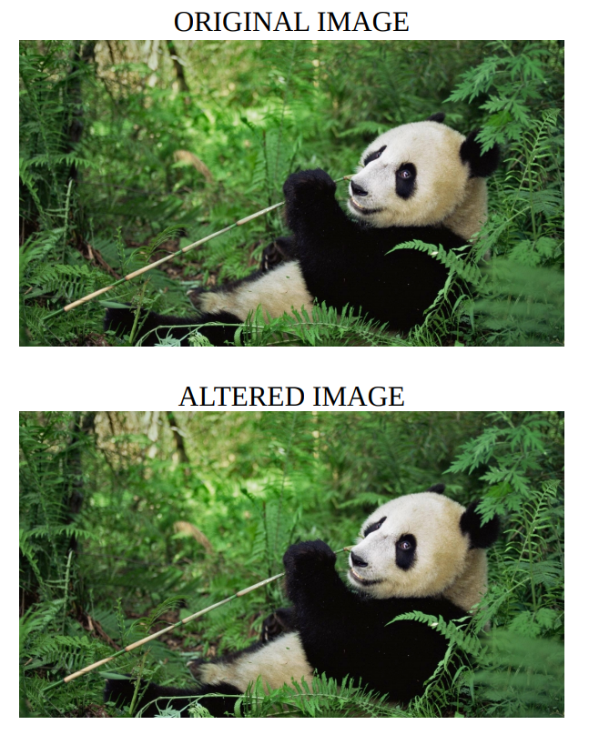
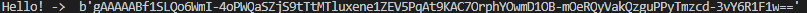

# Pyhton_Steganography

## Usage

>Hiding message to image or audio files.

For Image Files
```python
stega_img = stg.Steganography("your_image_name.jpg")
stega_img.Write_Image("Hello There Image File!")
print(stega_img.Read_Image("Steganography.bmp"))
```
For Audio Files
```python
stega_audio=stg.Steganography("your_file_name.wav")
stega_audio.Write_Audio("Hello There Audio File!")
print(stega_audio.Read_Audio("Steganography.wav"))
```
**Note**: Supported file types are jpg, bmp for images and wav for audio.

## What is Steganography?

> [Steganography](https://en.wikipedia.org/wiki/Steganography) is the practice of concealing a file, message, image, or video within another file, message, image, or video.

## How It Works

> We are using the [Least Sigificant Bit](https://en.wikipedia.org/wiki/Bit_numbering) method. This way there is no noticable difference beetween input and output images or audio files.




>For extra security we are encyrpting the message before hide it inside image using [Fernet](https://cryptography.io/en/latest/fernet.html).

